# AI Resume Analyzer — Project Architecture

## Table of Contents

1. [System Architecture](#1-system-architecture)
2. [Request Flow — User to App](#2-request-flow--user-to-app)
3. [Project File Structure](#3-project-file-structure)
4. [Data Models & Schemas](#4-data-models--schemas)
5. [Frontend Routes](#5-frontend-routes)
6. [Backend (Puter.js API Surface)](#6-backend-puterjs-api-surface)
7. [Scaling Strategy](#7-scaling-strategy)

---

## 1. System Architecture

This is a **client-side SPA** (Single Page Application) built with **React Router v7** (SPA mode, `ssr: false`). There is **no custom backend server** — all backend services (auth, file storage, key-value database, AI) are provided by **Puter.js**, a Browser-as-a-Service platform loaded via a `<script>` tag.

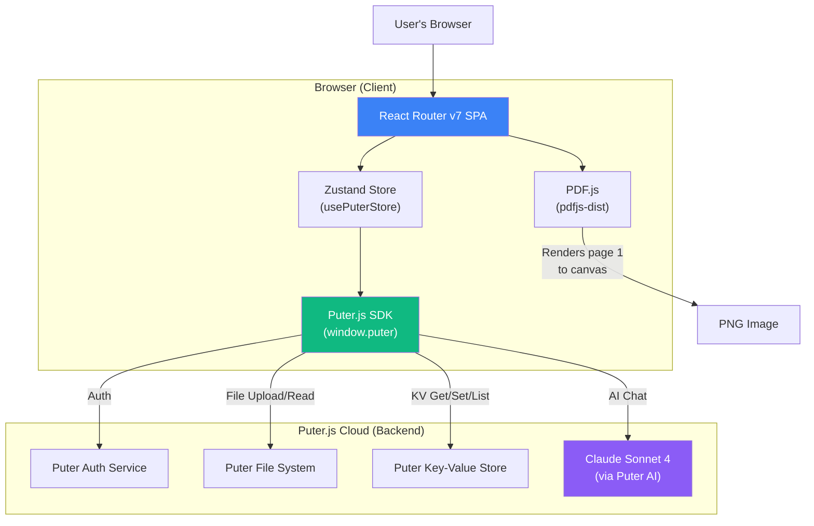

### Entry Point Chain

| Step | File | What Happens |
|------|------|-------------|
| 1 | [vite.config.ts](file:///c:/Users/Amartya/Dropbox/PC/Desktop/Projects/AI-RESUME-ANALYZER/vite.config.ts) | Vite bootstraps the app with TailwindCSS + React Router + tsconfig paths |
| 2 | [react-router.config.ts](file:///c:/Users/Amartya/Dropbox/PC/Desktop/Projects/AI-RESUME-ANALYZER/react-router.config.ts) | Sets `ssr: false` — the app runs entirely as a client-side SPA |
| 3 | [app/root.tsx](file:///c:/Users/Amartya/Dropbox/PC/Desktop/Projects/AI-RESUME-ANALYZER/app/root.tsx) | `Layout` component renders `<html>`, loads Puter.js via `<script>`, calls `init()` to connect to Puter SDK |
| 4 | [app/routes.ts](file:///c:/Users/Amartya/Dropbox/PC/Desktop/Projects/AI-RESUME-ANALYZER/app/routes.ts) | Defines all routes — `/`, `/auth`, `/upload`, `/resume/:id`, `/wipe` |
| 5 | Route components | Each route renders its page using the shared `usePuterStore` Zustand store |

---

## 2. Request Flow — User to App

### Flow 1: Resume Upload & Analysis (Core Feature)

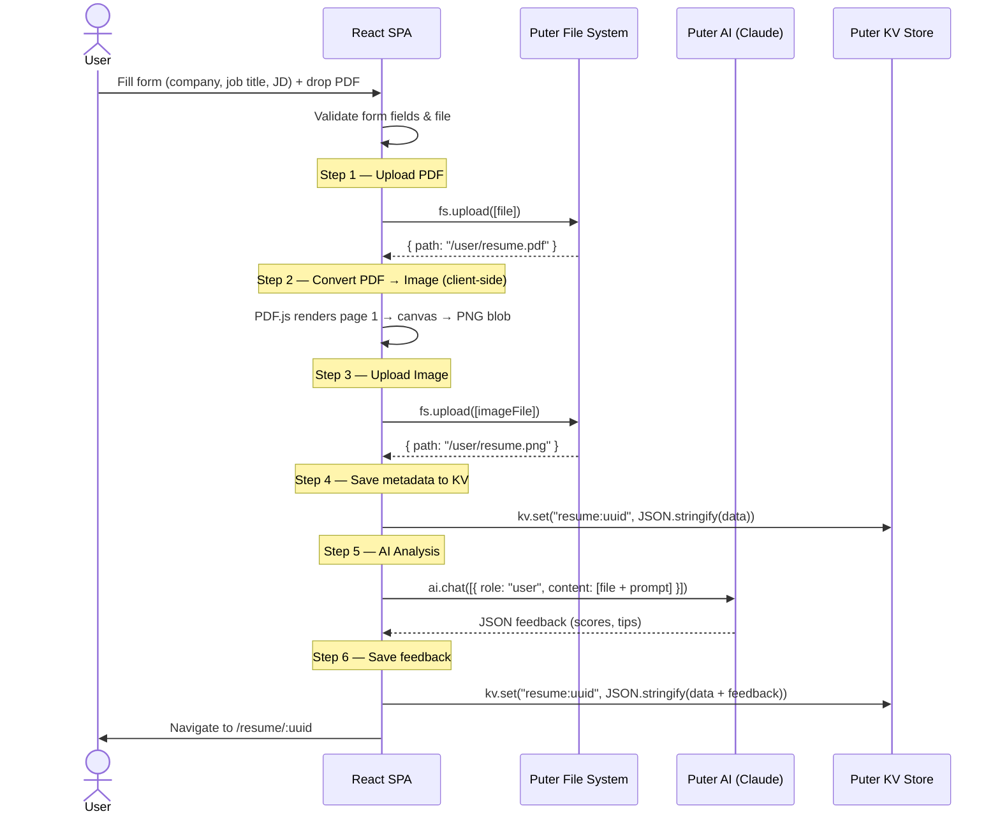

### Flow 2: Authentication

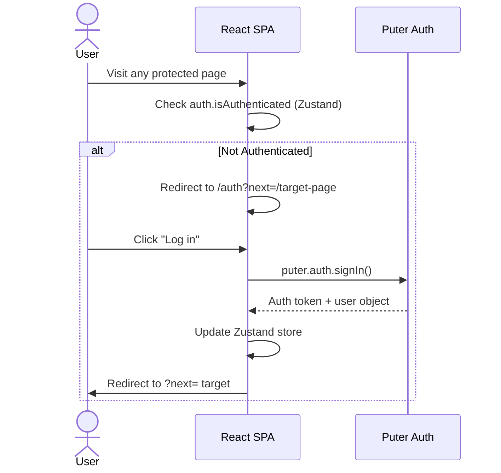

### Flow 3: Viewing Resume Results

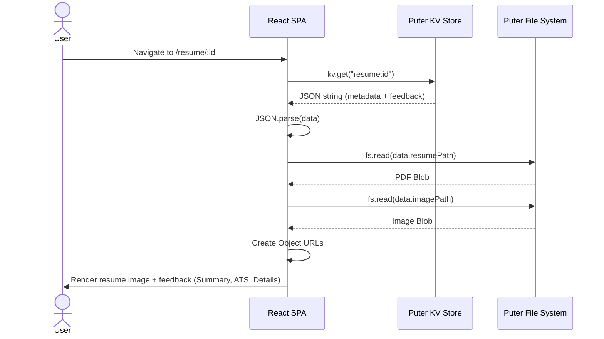

---

## 3. Project File Structure

```
AI-RESUME-ANALYZER/
├── app/                            # Application source code
│   ├── root.tsx                    # Root layout — <html>, <head>, <body>, Puter init
│   ├── routes.ts                   # Route definitions (React Router v7)
│   ├── app.css                     # Global styles + Tailwind imports
│   │
│   ├── routes/                     # Page-level components (1 per route)
│   │   ├── home.tsx                # "/" — Dashboard listing all resumes
│   │   ├── auth.tsx                # "/auth" — Login/logout page
│   │   ├── upload.tsx              # "/upload" — Upload form + analysis trigger
│   │   ├── resume.tsx              # "/resume/:id" — Detailed feedback view
│   │   └── wipe.tsx                # "/wipe" — Dev tool to clear all data
│   │
│   ├── components/                 # Reusable UI components
│   │   ├── NavBar.tsx              # Top navigation bar
│   │   ├── FileUploader.tsx        # Drag-and-drop PDF uploader (react-dropzone)
│   │   ├── ResumeCard.tsx          # Card for each resume on home page
│   │   ├── Summary.tsx             # Overall score + category breakdown
│   │   ├── ScoreGauge.tsx          # Circular score gauge (SVG)
│   │   ├── ScoreBadge.tsx          # Colored score pill badge
│   │   ├── ScoreCircle.tsx         # Circular score indicator
│   │   ├── ATS.tsx                 # ATS score section with tips
│   │   ├── Details.tsx             # Expandable category details (accordion)
│   │   └── Accordion.tsx           # Custom accordion component
│   │
│   └── lib/                        # Utilities and integrations
│       ├── puter.ts                # Zustand store — wraps entire Puter.js SDK
│       ├── pdf2image.ts            # PDF → PNG conversion using PDF.js
│       └── utils.ts                # Helpers (cn, generateUUID)
│
├── constants/
│   └── index.ts                    # AI prompt template + mock resume data
│
├── types/
│   ├── index.d.ts                  # App types (Resume, Feedback, Job)
│   └── puter.d.ts                  # Puter SDK types (FSItem, PuterUser, etc.)
│
├── public/                         # Static assets (images, icons, SVGs)
├── build/                          # Production build output
│
├── vite.config.ts                  # Vite config (TailwindCSS + React Router)
├── react-router.config.ts          # SPA mode config (ssr: false)
├── tsconfig.json                   # TypeScript config
├── package.json                    # Dependencies & scripts
├── Dockerfile                      # Multi-stage Docker build
├── client-tools.ts                 # Auto-generated DOM tools (not used in app)
└── actions.json                    # Web agent action definitions
```

---

## 4. Data Models & Schemas

### Entity Relationship Diagram

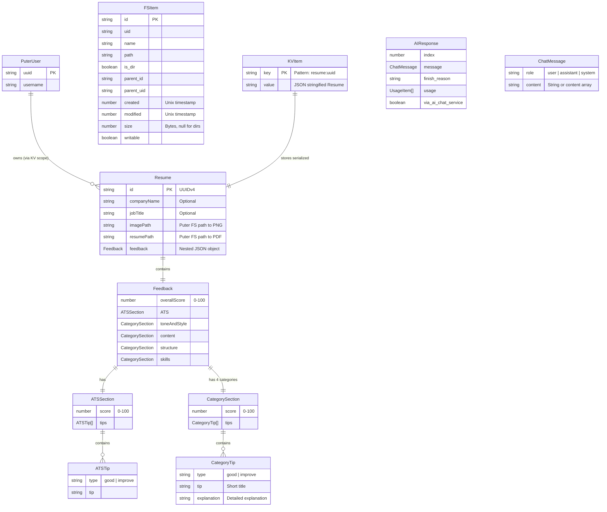

### Storage Model

The app uses **Puter KV** as its database. Data is stored as serialized JSON:

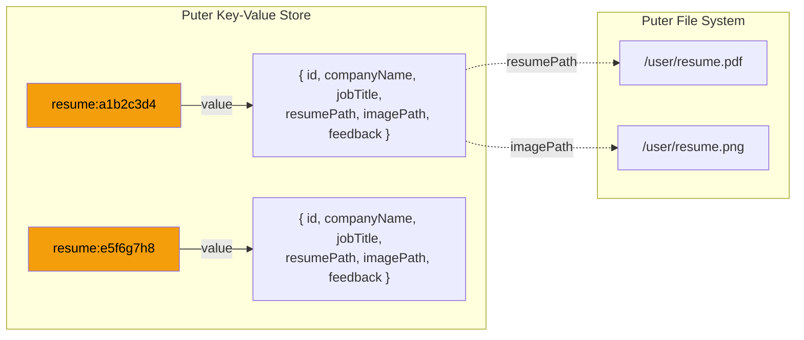

### TypeScript Type Definitions

The full types are defined in two files:

| File | Types Defined |
|------|--------------|
| [types/index.d.ts](file:///c:/Users/Amartya/Dropbox/PC/Desktop/Projects/AI-RESUME-ANALYZER/types/index.d.ts) | `Job`, `Resume`, `Feedback` |
| [types/puter.d.ts](file:///c:/Users/Amartya/Dropbox/PC/Desktop/Projects/AI-RESUME-ANALYZER/types/puter.d.ts) | `FSItem`, `PuterUser`, `KVItem`, `ChatMessage`, `ChatMessageContent`, `PuterChatOptions`, `AIResponse` |

---

## 5. Frontend Routes

| Route | File | Auth Required | Purpose |
|-------|------|:---:|---------|
| `/` | [home.tsx](file:///c:/Users/Amartya/Dropbox/PC/Desktop/Projects/AI-RESUME-ANALYZER/app/routes/home.tsx) | ✅ | Dashboard — lists all analyzed resumes from KV store |
| `/auth` | [auth.tsx](file:///c:/Users/Amartya/Dropbox/PC/Desktop/Projects/AI-RESUME-ANALYZER/app/routes/auth.tsx) | ❌ | Login/logout page, redirects via `?next=` param |
| `/upload` | [upload.tsx](file:///c:/Users/Amartya/Dropbox/PC/Desktop/Projects/AI-RESUME-ANALYZER/app/routes/upload.tsx) | ✅ | Form to upload resume + job details, triggers AI analysis |
| `/resume/:id` | [resume.tsx](file:///c:/Users/Amartya/Dropbox/PC/Desktop/Projects/AI-RESUME-ANALYZER/app/routes/resume.tsx) | ✅ | Detailed view — resume image + ATS score + feedback sections |
| `/wipe` | [wipe.tsx](file:///c:/Users/Amartya/Dropbox/PC/Desktop/Projects/AI-RESUME-ANALYZER/app/routes/wipe.tsx) | ✅ | Dev/admin tool — lists files and wipes all KV + FS data |

### Route Configuration

Defined in [app/routes.ts](file:///c:/Users/Amartya/Dropbox/PC/Desktop/Projects/AI-RESUME-ANALYZER/app/routes.ts):

```typescript
export default [
  index("routes/home.tsx"),          // /
  route('/auth', "routes/auth.tsx"), // /auth
  route('/upload', "routes/upload.tsx"),   // /upload
  route('/resume/:id', "routes/resume.tsx"), // /resume/:id
  route('/wipe', 'routes/wipe.tsx') // /wipe
] satisfies RouteConfig;
```

### Auth Guard Pattern

There is no centralized auth middleware. Each route manually checks auth status:

```typescript
// Pattern used in home.tsx, resume.tsx, wipe.tsx
useEffect(() => {
  if (!isLoading && !auth.isAuthenticated) {
    navigate('/auth?next=/current-path');
  }
}, [isLoading]);
```

---

## 6. Backend (Puter.js API Surface)

Since there is **no custom backend**, all "backend" operations are Puter.js SDK calls made from the browser. The entire SDK is wrapped in a Zustand store at [app/lib/puter.ts](file:///c:/Users/Amartya/Dropbox/PC/Desktop/Projects/AI-RESUME-ANALYZER/app/lib/puter.ts).

### API Surface

| Service | Method | Used In | Purpose |
|---------|--------|---------|---------|
| **Auth** | `puter.auth.signIn()` | [auth.tsx](file:///c:/Users/Amartya/Dropbox/PC/Desktop/Projects/AI-RESUME-ANALYZER/app/routes/auth.tsx) | Trigger Puter OAuth login |
| **Auth** | `puter.auth.signOut()` | [auth.tsx](file:///c:/Users/Amartya/Dropbox/PC/Desktop/Projects/AI-RESUME-ANALYZER/app/routes/auth.tsx) | Log user out |
| **Auth** | `puter.auth.isSignedIn()` | [puter.ts](file:///c:/Users/Amartya/Dropbox/PC/Desktop/Projects/AI-RESUME-ANALYZER/app/lib/puter.ts) | Check auth status on init |
| **Auth** | `puter.auth.getUser()` | [puter.ts](file:///c:/Users/Amartya/Dropbox/PC/Desktop/Projects/AI-RESUME-ANALYZER/app/lib/puter.ts) | Fetch user profile |
| **FS** | `puter.fs.upload([file])` | [upload.tsx](file:///c:/Users/Amartya/Dropbox/PC/Desktop/Projects/AI-RESUME-ANALYZER/app/routes/upload.tsx) | Upload PDF and PNG files |
| **FS** | `puter.fs.read(path)` | [resume.tsx](file:///c:/Users/Amartya/Dropbox/PC/Desktop/Projects/AI-RESUME-ANALYZER/app/routes/resume.tsx) | Read file as Blob for display |
| **FS** | `puter.fs.readdir(path)` | [wipe.tsx](file:///c:/Users/Amartya/Dropbox/PC/Desktop/Projects/AI-RESUME-ANALYZER/app/routes/wipe.tsx) | List all user files |
| **FS** | `puter.fs.delete(path)` | [wipe.tsx](file:///c:/Users/Amartya/Dropbox/PC/Desktop/Projects/AI-RESUME-ANALYZER/app/routes/wipe.tsx) | Delete individual files |
| **KV** | `puter.kv.set(key, value)` | [upload.tsx](file:///c:/Users/Amartya/Dropbox/PC/Desktop/Projects/AI-RESUME-ANALYZER/app/routes/upload.tsx) | Store resume metadata + feedback |
| **KV** | `puter.kv.get(key)` | [resume.tsx](file:///c:/Users/Amartya/Dropbox/PC/Desktop/Projects/AI-RESUME-ANALYZER/app/routes/resume.tsx) | Retrieve single resume by ID |
| **KV** | `puter.kv.list(pattern, true)` | [home.tsx](file:///c:/Users/Amartya/Dropbox/PC/Desktop/Projects/AI-RESUME-ANALYZER/app/routes/home.tsx) | List all resumes (`resume:*`) |
| **KV** | `puter.kv.flush()` | [wipe.tsx](file:///c:/Users/Amartya/Dropbox/PC/Desktop/Projects/AI-RESUME-ANALYZER/app/routes/wipe.tsx) | Clear entire KV store |
| **AI** | `puter.ai.chat(messages, options)` | [puter.ts](file:///c:/Users/Amartya/Dropbox/PC/Desktop/Projects/AI-RESUME-ANALYZER/app/lib/puter.ts#L330-L355) | Send resume file + prompt to Claude Sonnet 4 |

### AI Prompt Architecture

The AI analysis prompt is constructed in [constants/index.ts](file:///c:/Users/Amartya/Dropbox/PC/Desktop/Projects/AI-RESUME-ANALYZER/constants/index.ts#L228-L246):

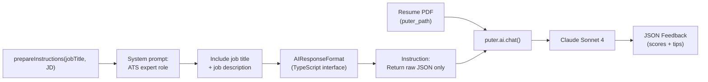

---

## 7. Scaling Strategy

### Current Limitations

| Concern | Current State | Risk Level |
|---------|--------------|:---:|
| Backend | Zero custom backend — all on Puter.js | 🔴 High vendor lock-in |
| Database | KV store (flat key-value, no queries) | 🔴 No filtering, sorting, pagination |
| PDF processing | Client-side (PDF.js on canvas) | 🟡 Slow on large/multi-page PDFs |
| Auth | No user-scoped KV keys | 🔴 Any user can guess UUIDs |
| Error handling | No try-catch on JSON.parse | 🔴 App crashes on malformed AI response |
| State mgmt | One 450-line Zustand store | 🟡 Hard to maintain at scale |
| Testing | No tests | 🔴 No safety net for changes |

### Phase 1 — Harden the MVP (Quick Wins)

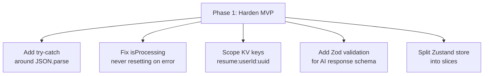

### Phase 2 — Add a Real Backend

Replace Puter.js with a proper backend to unlock querying, caching, and multi-tenancy:

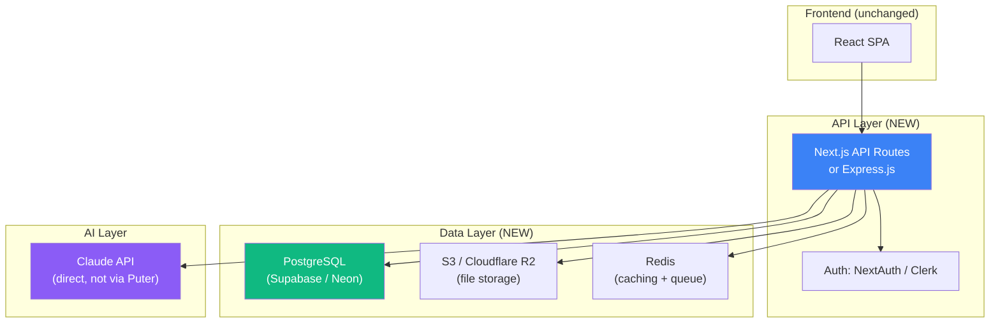

| Component | Current (Puter) | Scaled Replacement | Why |
|-----------|---------------|-------------------|-----|
| Auth | `puter.auth` | NextAuth / Clerk | OAuth + RBAC + team accounts |
| File Storage | `puter.fs` | S3 / Cloudflare R2 | Cheaper, CDN, access control |
| Database | `puter.kv` | PostgreSQL | Queries, indexes, relations |
| AI | `puter.ai.chat` | Direct Claude API | Rate limit control, retries, streaming |
| PDF → Image | Client-side PDF.js | Server-side `pdf-to-img` | Faster, supports multi-page |

### Phase 3 — Production Scale Architecture

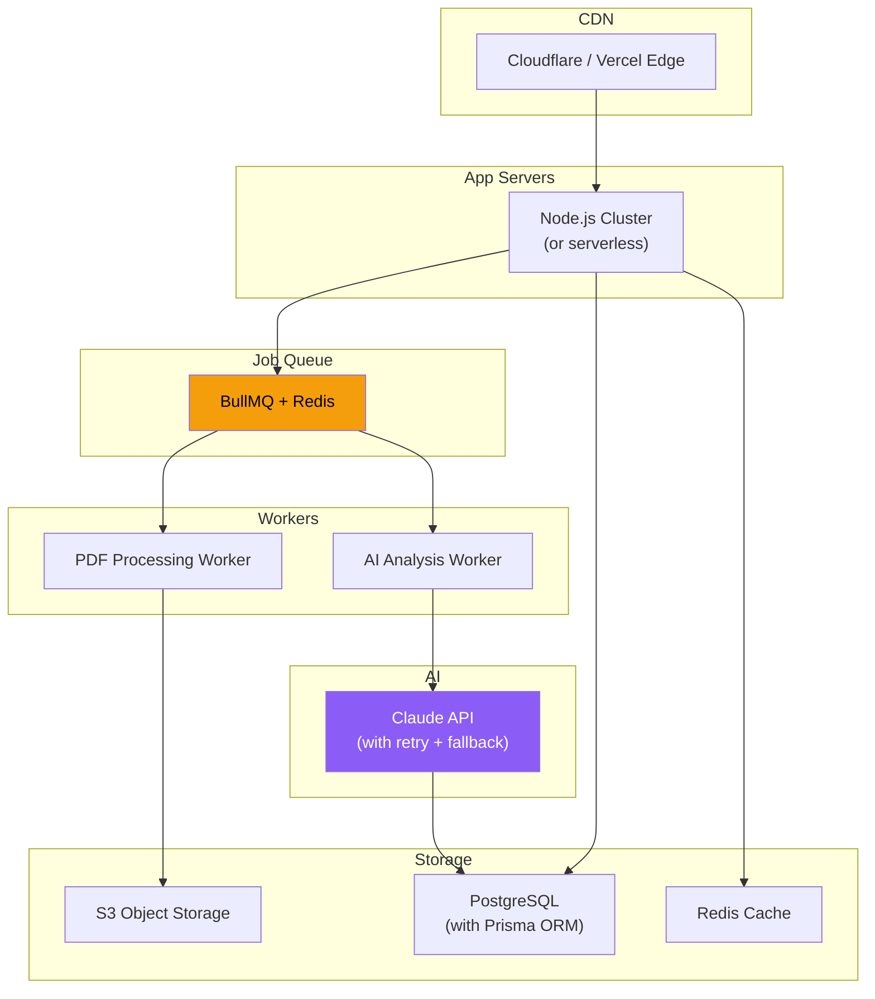

Key changes at scale:

| Feature | Implementation |
|---------|---------------|
| **Async processing** | Move AI analysis to a background job queue (BullMQ). User uploads → gets a "processing" status → polls or gets websocket notification |
| **Multi-page PDF** | Process all pages server-side, generate thumbnail grid |
| **Resume versioning** | `resumes` table with `version` column, diff comparison view |
| **Team features** | Organizations, shared resume pools, role-based access |
| **Caching** | Redis cache for AI results (same resume + same JD = cached response) |
| **Rate limiting** | Per-user limits on AI calls (e.g., 10 analyses/day on free tier) |
| **Monitoring** | Sentry for errors, Datadog/Grafana for metrics, structured logging |
| **CI/CD** | GitHub Actions → Docker build → deploy to Cloud Run / Fly.io |

### Database Schema at Scale

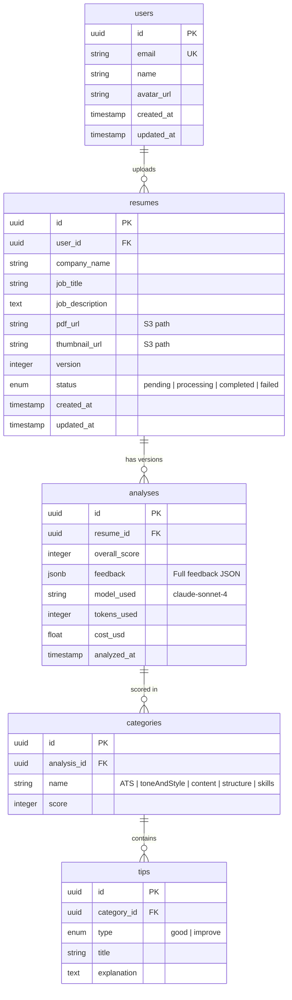

---

> [!TIP]
> **For interviews**: Start with "This is an MVP using Puter.js as BaaS — here's how I'd scale it" and walk through Phases 1→3. This shows both pragmatism (ship fast) and architectural maturity (know how to scale).
